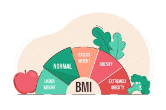

# Obesity EDA and Prediction Project
**This repository contains an exploratory data analysis (EDA) and machine learning model for predicting obesity levels based on various factors. The project follows two main steps: performing detailed EDA to understand the data and then applying a machine learning model for predicting obesity. The dataset includes demographic, lifestyle, and health factors that may contribute to obesity.**

## Project Structure

1. **Exploratory Data Analysis (EDA)**: This step involves analyzing the dataset to uncover patterns, distributions, and correlations between various variables and obesity.

2. **Model Training**: In this step, we build a predictive model using various machine learning algorithms and evaluate its performance.

## Steps Covered

1. **Data Cleaning**: Handle missing values, detect and remove outliers, and perform necessary preprocessing for accurate modeling.

2. **Visualization**: Several visualization techniques are used to understand the relationships between features, and their impact on obesity.

3. **Modeling**: Different machine learning algorithms (such as Logistic Regression, Random Forest, and others) are implemented to predict the obesity level.

4. **Model Evaluation**: The trained model is evaluated using performance metrics like accuracy, precision, recall, and F1-score.

## Libraries Used

- pandas
- numpy
- matplotlib
- seaborn
- scikit-learn

